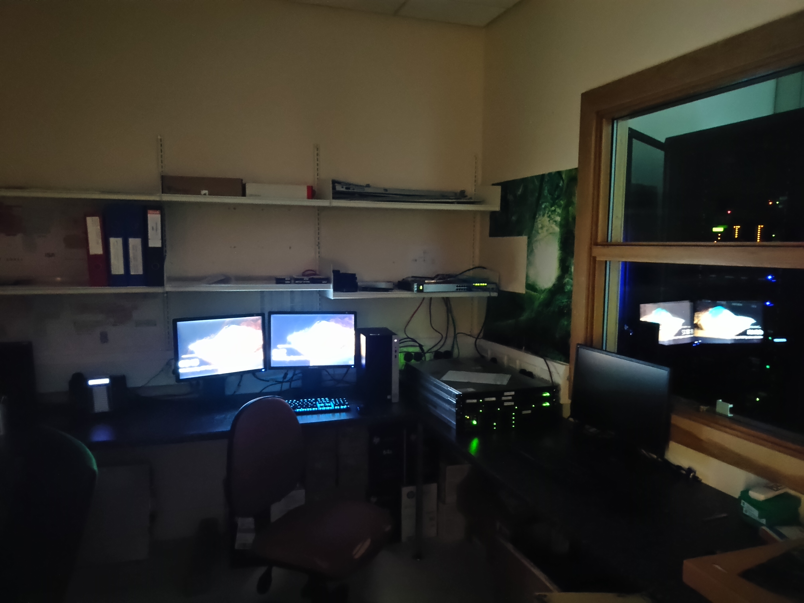

# Project Lab Documentation & Guides

*This is the old lab environment, need to update image later with new lab.*

## About

The project lab is a space for working on both in-school curriculum based projects and for personal computer science related projects such that you have access to the schools resources. Whether it be a programming project that needs some extra computing power or 3d printing a model you created for a project, this is the space to do that.

This lab is maintained by students with support from the computer science and IT department.

### Features avaliable in the lab

The project lab has many technologies avaliable for student use.

1. High Performance Computing Cluster (HPC) - for data science, modeling, machine learning etc.
2. General purpose computing - there is a workstation and a server avaliable for general use, whether it be for programming, 3d modeling or testing out code
3. 3D Printers - there are two 3d printers avaliable in the project lab that can be used with permission for printing
4. Networking equiptment - there is an assortment of network equiptment that can be played with in a lab environment

## General Info

Below is the front of the server rack, with each device and their respective roles listed below

1. Network Router - responsible for the internet connection
2. Main Network Switch - responsible for connecting all of the devices, it also has a fibre link (blue and orange cables) to the switch on the desktop
3. Domain controller - responsible for DNS and storing files
4. GPU / Compute Server - This is the high performance server that is responsible for all of the heavy computation tasks
5. Misc other equiptment for messing around with 

### Network Topology

The following chart outlines the structure of the LAN in the project lab. This network has a full 100mbps connection but no wireless avaliable. 

## Server Management 

There are two main servers, the gpu server shown below, and the domain controller which hosts project files, serves the internet connection and can be used to host projects. This server will almost never need to be logged into or maintained as it runs 24/7 during school time. There will be instructions to follow on how to shutdown, startup, login and diagnose problems in the network.

Above is the main compute server with a 10 Core Intel Xeon CPU, 56 GB of RAM and an NVIDIA TESLA K80 graphics card.

### Logging Into the server

## Miscellaneous Lab Info
